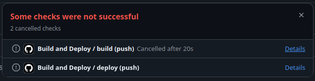
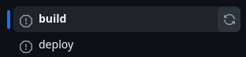

# SaṃskṛtaSamiti, IIT Madras

**SaṃskṛtaSamiti** is a student body at the Indian Institute of Technology Madras (IITM) dedicated to the study, promotion, and appreciation of the **Sanskrit language** and its rich literary tradition.

This repository hosts the **official website** of SaṃskṛtaSamiti, built with [Jekyll](https://jekyllrb.com/) with the [Chirpy Theme](https://github.com/cotes2020/jekyll-theme-chirpy), and deployed via **GitHub Pages**.

---

## ℹ️ About the Website

This site primarily serves as a digital **repository of original Sanskrit compositions** contributed mainly by members of SaṃskṛtaSamiti and the general student body of IIT Madras.

### Features
- 🪶 Original Sanskrit verses by students
- 🔄 Click-to-toggle **sandhi-splits**
- 🎵 Integrated **metrical (chandas)** information

---
## Contributing

### Getting Started

The recommended development environment is Linux with **Ruby, Bundler, Jekyll and [Python](https://docs.python-guide.org/starting/install3/linux/)** installed. It is also recommended to use [VSCode](https://code.visualstudio.com/docs/setup/linux). The following steps have been tested on Ubuntu 22.04 and 24.04.

Run the following commands in the terminal (`ctrl+alt+T`):

First, clone and enter this repository:

```bash
git clone https://github.com/sanskrit-iitm/sanskrit-iitm.github.io.git
cd sanskrit-iitm.github.io
```


To run the site locally, you need to install Ruby, Bundler, and Jekyll:

```bash
sudo snap install ruby
sudo apt install ruby-bundler
sudo bundle install
```

If these installed correctly, you should be able to run the site locally:

```bash
source run_locally.sh
```

This should open a local version of the website hosted at http://127.0.0.1:4000/.

If you want to use the automated tools for grammatical analysis, install the required packages:

```bash
pip install -r requirements.txt
```

You're now all set to begin contributing posts!

### Creating a New Post

All posts are [markdown](https://www.markdownguide.org/) files that live in `./_posts` and must be named in the specific format `YYYY-MM-DD-post-title.md`. Every post must have specific metadata in the "front matter". The content of a post supports, in addition to [standard markdown syntax](https://www.markdownguide.org/cheat-sheet/), some custom HTML blocks for rendering verses, sandhi-splits, etc. These are written in `./_includes` and `./_plugins`. They can be "instantiated" inside a post using [liquid](https://shopify.github.io/liquid/basics/introduction/) code.

To make this process simpler, it is recommended to use the `create_post.sh` script for creating a new post:

```bash
source create_post.sh "Title of Post"
```

This will create the file `./_posts/YYYY-MM-DD-title-of-post.md` with the present timestamp of your machine, that is already filled with a dummy header and liquid code templates for instantiating custom blocks.

> **📝 NOTE:**
>
> As a general convention, the "`Title of Post`" must be in [Title Case](https://titlecaseconverter.com/). Any Sanskrit words in the title must be in [IAST](https://en.wikipedia.org/wiki/International_Alphabet_of_Sanskrit_Transliteration).

### Configuring Front Matter in a New Post

If you open the post you just created, you will see "front matter" like this:

```yml
---
title: Test Post
permalink: /posts/test-post # Change to harvard kyoto
date: 2025-10-29 23:52:43 +0100
categories: [Verse Sessions 1946]
tags: []  # TAG names should always be lowercase
authors: [AUTHOR1, AUTHOR2]
description: 
# toc: false
# comments: false
---
```

This is a guide to each of these fields:

1. `title`: This is the title of your post, as specified when running the `create_post.sh` script. It must be in [Title Case](https://titlecaseconverter.com/), and any Sanskrit words here must be in [IAST](https://en.wikipedia.org/wiki/International_Alphabet_of_Sanskrit_Transliteration).
2. `permalink`: This is the part of the link that will appear after [sanskrit-iitm.github.io](sanskrit-iitm.github.io). It cannot contain non-[ASCII](https://en.wikipedia.org/wiki/ASCII) characters. Hence, any Sanskrit words here must be in [Harvard-Kyoto](https://en.wikipedia.org/wiki/Harvard-Kyoto).
3. `date`: This is the date that will be displayed under the post's title. It must typically be related to the post's content rather than the date of the post being published on the website. Ex: If a Samasyā Challenge was posed on 21-10-2025, and you are publishing the corresponding blog post on 27-10-2025, this field must be 21-10-2025.
4. `categories`: Comma-separated names of all categories this post must be displayed under. Categories are in [Title Case](https://titlecaseconverter.com).
5. `tags`: Comma-separated names of all tags associated with the post. Tags are in lowercase.
6. `authors`: Comma-separated names of all "author-keys". Author keys can be found in `./_data/authors.yml`.
7. `description`: Short description that will appear under the post's block in the homepage.
8. `toc`: Toggle displaying table of contents. On by default
9. `comments`: Toggle displaying comments. On by default.

### Using Custom Templates

You will also see two other custom code blocks:

#### Toggler
```html
{%t सन्ध्यादियुक्तवाक्यांशोऽयम्|सन्धि-आदि-युक्त-वाक्य-अंशः_अयम्}
```

You can make any word toggle between two forms using a pipe `|` separator. Underscores `_` in the alternate form are automatically shown as spaces. Enclosing text in this format enables the following functionality when displayed on the site: `सन्ध्यादियुक्तवाक्यांशोऽयम्`, upon being clicked, renders as `सन्धि-आदि-युक्त-वाक्य-अंशः अयम्`, and vice versa.

#### Verse Block

```html
<!-- Verse format -->


```

1. `author`: As in the front matter, this must be a key from `./_data/authors.yml`
2. `meter`: This must be a key from `./_data/meters.yml`
3. `verse`: The verse, typically in Devanāgarī.
> **NOTE:** Be sure to use the Devanāgarī daṇḍa `।` for line-breaks, and **NOT** the pipe symbol `|`. Mixing these up can cause the grammar analyser to malfunction.
4. `anvaya`: Optionally, fill the anvaya of the verse. Highly recommended for verses that are difficult to parse.

### Adding New Authors or Meters

#### New Author
To add a new author, add a new entry in `./_data/authors.yml` with the following fields filled as indicated:

```yml
author-key:
  name: देवनागर्यां नाम
  name_iast: IAST-lipyāṃ nāma
  name_eng: Name in English
  url: /authors/author-key
  # Optional (beta):
  photo: /img/author_photos/photo.png
  bio: Short description of the author
```

Author pages are generated automatically at `sanskrit-iitm.github.io/authors/<author-key>`.

#### New Meter

To add a new meter, add a new entry in `./_data/meters.yml` with the following fields filled as indicated:

```yml
meter-key:
  name: देवनागर्यां नाम
  name_iast: IAST-lipyāṃ nāma
  link: "https://sanskritsahitya.org/chhanda/name-of-meter"
```

The `meter-key` must be in Harvard-Kyoto.

The `link`ed source must provide at the least a definition or example of the meter. The most preferred source is the https://sanskritsahitya.org/chhanda website's entry of the meter, as this provides not only the definition and an example, but also has audio recordings of the meter being rendered. However, this website at present only lists fairly common meters, and may not contain more obscure ones. In such cases, another source like https://github.com/shreevatsa/sanskrit/blob/master/data or https://www.wisdomlib.org may be linked.

### Running Automated Sandhi Splits

After creating a new post, perform the following steps to automatically perform Sandhi-splits in the verses (This is presently powered using [Dharmamitra](https://dharmamitra.github.io/dharmamitra-guides/mitra_tools/sanskrit_grammar.html). This might be replaced by Vidyut in the future, to also perform automated Chandas-verification. If you are interested in contributing, please reach out).

```bash
cd grammar
python llm_analyser.py
```

## Deployment

After you have made new changes, run

```bash
source run_locally.sh
```

to verify that all your changes display as desired. **DO NOT PROCEED** if any changes render awkwardly or in an unintended manner - Debug the issue first.

If all changes work as intended, perform the following steps:

```bash
git pull
git add ./modified_file_1 ./modfified_file_2
git commit -m "Description of the changes you made"
git push
```

The first time you do this, you will be asked to provide your username and password. Provide your github username as username, and your access token as password.

After pushing, go to the [GitHub repository](https://github.com/sanskrit-iitm/sanskrit-iitm.github.io) and verify that all actions triggered by your push succeeded. You should see a green check mark next to your commit:


If you instead see a red cross, click on the cross, click `Details` in the window that pops up, and re-run the failed jobs by clicking the `refresh` button next to `build` or `deploy`:





---
## Advanced Contributors
### 📁 Repository Structure
If you’d like to understand how the site is put together, these are the folders and files to pay attention to:

```bash
.
├── _config.yml          # Site configuration (including list of plugins to be auto-run upon push)
├── _includes/           # Reusable HTML snippets (e.g. verse.html)
│   ├── footer.html      # footer under each page
│   └── verse.html       # Custom verse block that can be included in posts
├── _layouts/            # Page templates (authors page, individual author page)
│   ├── authors.html     # Page displaying a block for each author in ../_data/authors.yml
│   └── author.html      # Page displaying verses of each author
├── _posts/              # Blog posts
├── _data/
│   ├── authors.yml      # Author metadata
│   └── meters.yml       # Meters used in verses
├── _plugins/            # Custom Ruby plugins (to auto-generate author-pages, enable toggling, etc.)
│   ├── extract-verses.rb # Extract and save all verses (specified using the custom liquid format) in all posts in site data
│   ├── generate-authors.rb # Generate page of all authors, and page for each author using the site data extracted with extract-verses.rb
│   └── toggle.rb        # Implement toggle functionality in all pages
├── grammar/             # Automate sandhi-splits (using, e.g., LLMs like Dharmamitra)
│   ├── language_analysis.py # Undo sandhi-s in a sentence and break compounds into constituent words
│   ├── formatter.py     # Perform language_analysis.py and apply toggler syntax for verses in a given .md file that aren't already manually annotated
│   └── llm_analyser.py  # Perform formatter.py for all .md files in ./_posts
├── assets/img/favicons  # Logo, favicons
├── requirements.txt     # Python packages required for grammar
├── create_post.sh       # Create new post
└── run_locally.sh       # Test the website locally
```